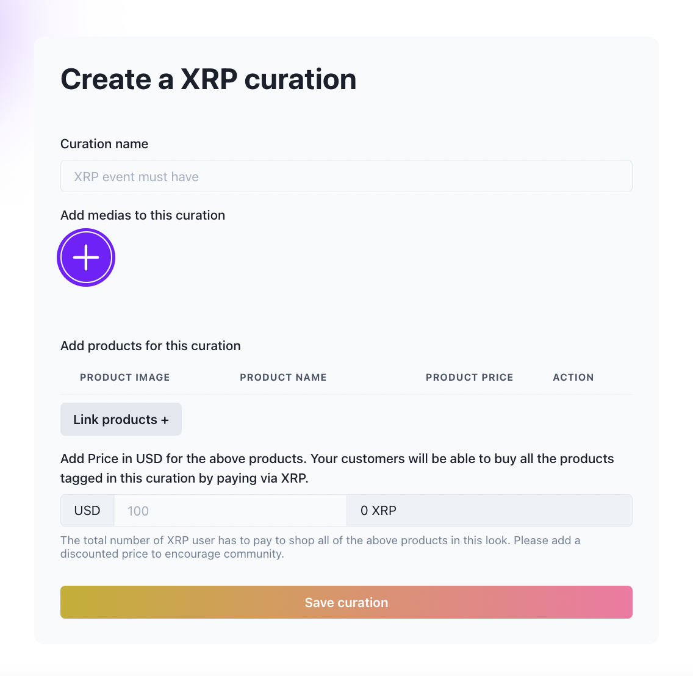
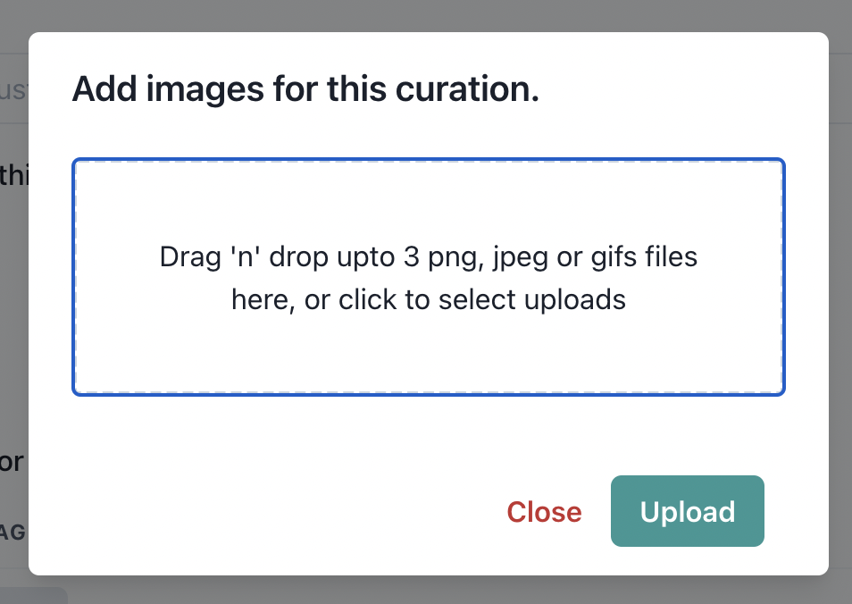
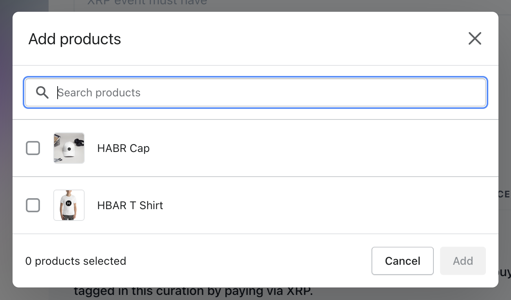
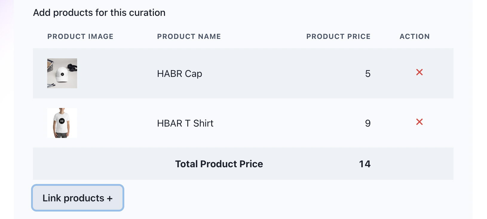
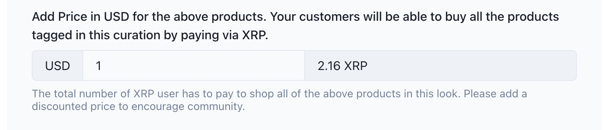
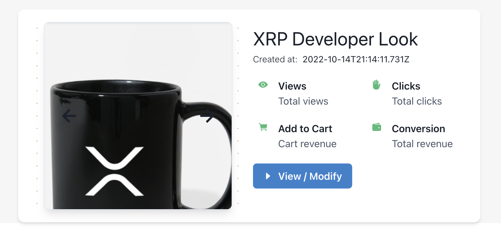
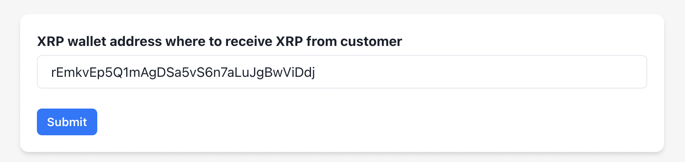
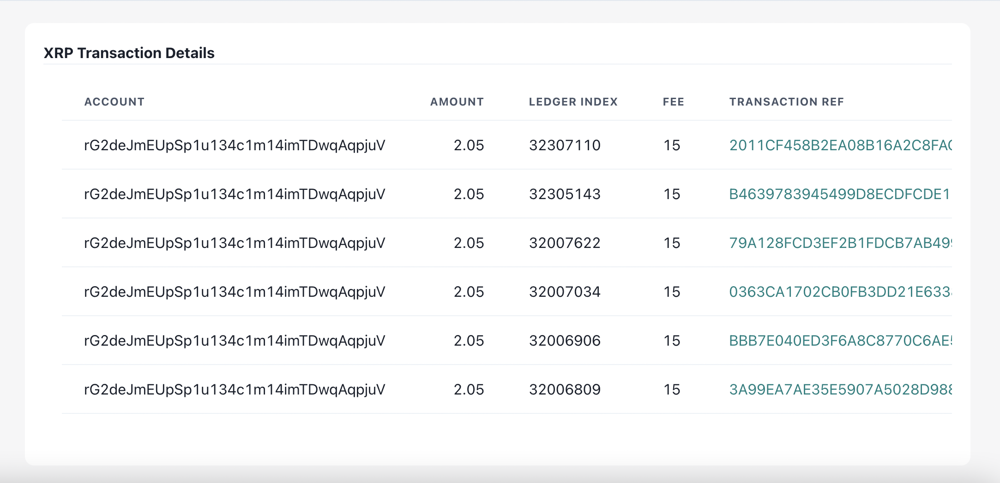
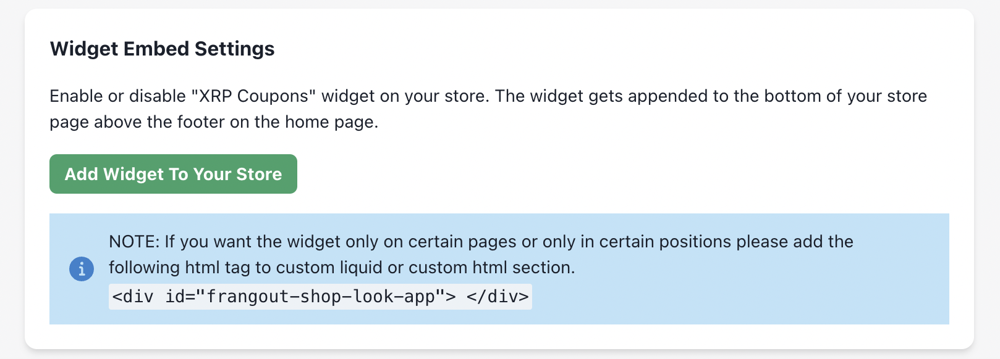

## XRP Shop Client
This project was bootstrapped with [Create React App](https://github.com/facebookincubator/create-react-app).
Below you will find some information on how to perform common tasks.

## Demo

  


## Creating look To Shop
<tabnle>
<tr>
<td></td>
</tr>
</table>
```
|- src
    |-- routes
        |-- look
```

- Add look name 
- Add media to look
    - on click of add media to look will open the popup
    - you can drag and drop imagges to upload, once click on upload following codes will be send API request to upload files
<tabnle>
<tr>
<td></td>
</tr>
</table>


```
const files = useFilesStore((state) => state.files);

const onUploadWidgetClose = (data = []) => {
    setUploads([...uploads, ...data]);
    onClose();
  };
```
```
|- src
    |-- store
        |-- files
```
```
const base64s = await Promise.all(
        uploads.map(async (upload) => {
          return {
            data: await getBase64(upload),
            type: upload.type,
          };
        })
      );
      const savedFiles = await Promise.all(
        base64s.map(async (base64) => {
          const parseFile = new Parse.File(
            "looks",
            { base64: base64.data },
            base64.type
          );
          // const savedFile = await parseFile.save();
          const { data } = await axios.post(
            `${process.env.REACT_APP_API_SHOPLOOKS_SERVER_URL}/parse/files/looks`,
            {
              base64: parseFile?._source?.base64 || parseFile._data,
              _ApplicationId: Parse.applicationId,
              _ClientVersion: "js3.4.1",
              _ContentType: parseFile?._source?.type,
              _JavaScriptKey: Parse.javaScriptKey,
              fileData: { metadata: {}, tags: {} },
            },
            {
              headers: {
                "content-type": "text/plain",
              },
            }
          );
          return data;
        })
      );
```

- Link Product to look
    - Products from the Shopify will be fetched throug [Shopify app bridge](https://www.npmjs.com/package/@shopify/app-bridge-react).

<table>
<tr>
<td></td>
</tr>
</table>
```
setProducts([
      // ...products.filter(Boolean),
      ...data?.selection
        ?.map((d) => {
          return {
            title: d.title,
            image: (d.images[0] && d.images[0]?.originalSrc) || "",
            id: d.id,
            price: parseInt(d.variants[0]?.price) || 0,
          };
        })
        .filter(Boolean),
    ]);
```
- once the products are selected product total valus will be calculated 
<table>
<tr>
<td></td>
</tr>
</table>

```
const [products, setProducts] = useState(props.looks.products || []);

let productSum = 0;
    const result = data.selection.reduce((p, n) => {
      productSum = p + parseFloat(n.variants[0].price);
      return productSum;
    }, 0);
    setTotlaProductsPrice(result);
```

- Adding discount price for the look in USD and calculating XRP value

- Fetch the XRP value using API
```
|- src
    |-- store
        |-- currency-exchage

const response = await axios.get('https://api.coingecko.com/api/v3/simple/price?ids=usd&vs_currencies=xrp')
```
- set the XRP value to 0 initially, and calculate the the XRP price
<table>
<tr>
<td></td>
</tr>
</table>

```
const [exchangeRate, setExchageRate] = useState();

const getExchangeRate = (data) => {
    console.log(data);
    setLookXrpPrice( 
      (currencyExchangeState.get.success.data.xrp * data).toFixed(2)
    );
  };

```

- Saving the look 
    - parse the data to save the look
```
await postLooks({
 name: looksName,
 price: looksPrice,
 xrpPrice: lookXrpPrice,
 medias: uploads,
 products: products.map((product) => product.id),
 });

 const { data } = await axios.post(`${process.env.REACT_APP_API_SHOPLOOKS_SERVER_URL}/api/post_looks`, 
 {
    shop,
    name,
    price,
    xrpPrice,
    medias,
    products,
});
```

- Displaying the look data
```
|- src
    |-- routes
        |-- index.js
```
## Display Looks using the API
<table>
<tr>
<td></td>
</tr>
</table>

```
const { data } = await axios.get(`${process.env.REACT_APP_API_SHOPLOOKS_SERVER_URL}/api/get_looks?shop=${shop}&id=${id}`);
```

## Adding XRP Wallet Address
<table>
<tr>
<td></td>
</tr>
</table>

- Validate Wallet address Using the [Multicoin Address Validator](https://www.npmjs.com/package/multicoin-address-validator).
    - Parse the validated data to save Using API 
    - for testnet XRP wallet address details refer [XRPL official website](https://xrpl.org)
```
const valid = WAValidator.validate(walletAddress, "ripple");

const { data } = await axios.post(`${process.env.REACT_APP_API_SHOPLOOKS_SERVER_URL}/api/put_shop`,
{
  shop,
  walletAddress,
});
```

## Display XRP Transaction detaills 

<table>
<tr>
<td>

</td>
</tr>
</table>

- Parse the Wallet address to API to get the transaction details

```
try {
      const {data} = await axios.get(`${process.env.REACT_APP_API_SHOPLOOKS_SERVER_URL}/api/get_shop?shop=${shop}`);
      const walletAddress = data.walletAddress;

      const client = new window.xrpl.Client(`${process.env.REACT_APP_XRP_TRANSACTION_FETCH_UTL}`);
      await client.connect();
      const response = await client.request({
        command: "account_tx",
        account: walletAddress,
      });
```

## Embed Widget to display in frontend

<table>
<tr>
<td></td>
</tr>
</table>

```
const enableWidget = async () => {
    try {
      await postScripts(shop);
      toast({
        title: `Widget added successfully! Please visit your online store after 30 seconds to check the widget.`,
        status: "success",
      });
      getScripts(shop);
    } catch (e) {
      toast({
        title: e.message || INTERNAL_SERVER_ERROR,
        status: "error",
      });
    }
  };

  const { data } = await axios.post(`${process.env.REACT_APP_API_SHOPLOOKS_SERVER_URL}/api/post_scripts`, { shop });

```

